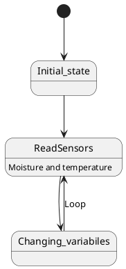

# Chapter 1

```plantuml
@startuml


[*] --> Initial_state
Initial_state --> ReadSensors
ReadSensors: Moisture and temperature
ReadSensors --> Changing_variabiles
Changing_variabiles --> ReadSensors : Loop
@enduml

```
