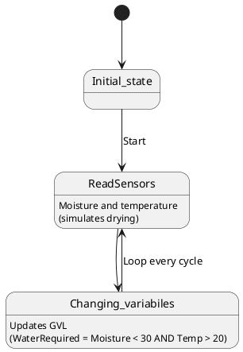

# Chapter 1

```plantuml
@startuml


[*] --> Initial_state
Initial_state --> ReadSensors : Start
ReadSensors: Moisture and temperature
ReadSensors: (simulates drying)
ReadSensors --> Changing_variabiles
Changing_variabiles --> ReadSensors : Loop every cycle
Changing_variabiles : Updates GVL
Changing_variabiles : (WaterRequired = Moisture < 30 AND Temp > 20)
@enduml

```
