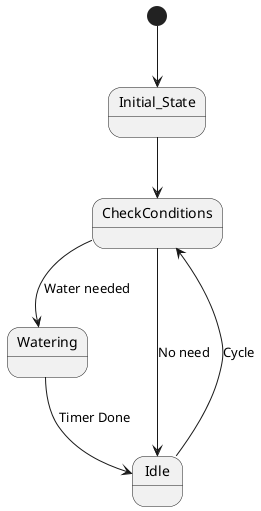

# Chapter 2

```plantuml
@startuml

[*] --> Initial_State
Initial_State--> CheckConditions
CheckConditions--> Watering : Water needed
CheckConditions--> Idle : No need
Watering--> Idle: Timer Done
Idle--> CheckConditions : Cycle


@enduml

```