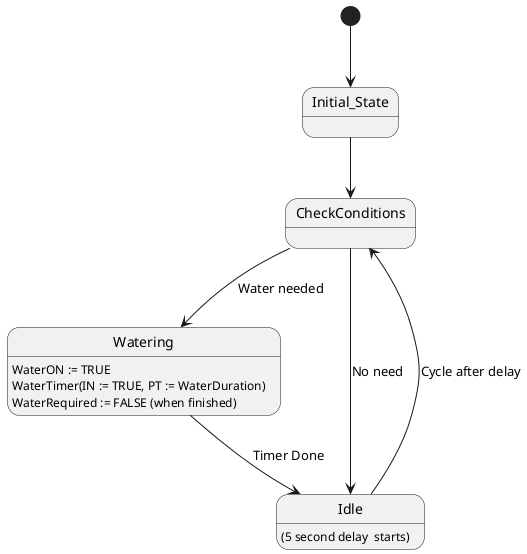

# Chapter 2

```plantuml
@startuml

[*] --> Initial_State
Initial_State--> CheckConditions
CheckConditions--> Watering : Water needed
CheckConditions--> Idle : No need
Watering--> Idle: Timer Done
Watering : WaterON := TRUE
Watering : WaterTimer(IN := TRUE, PT := WaterDuration)
Watering : WaterRequired := FALSE (when finished)
Idle--> CheckConditions : Cycle after delay
Idle : (5 second delay  starts)

@enduml

```