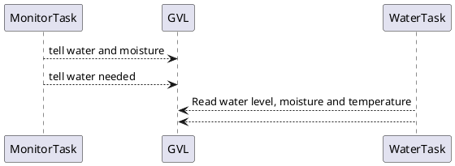

# Chapter 3

```plantuml
@startuml
MonitorTask--> GVL: tell water and moisture 
MonitorTask--> GVL: tell water needed
WaterTask--> GVL: Read water level, moisture and temperature
WaterTask--> GVL:
@enduml
```