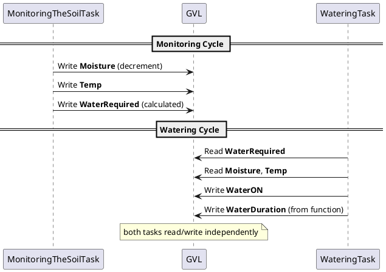

# Chapter 3

```plantuml
@startuml
participant "MonitoringTheSoilTask" as Monitor
participant "GVL" as GVL
participant "WateringTask" as Water

== Monitoring Cycle ==
Monitor -> GVL : Write **Moisture** (decrement)
Monitor -> GVL : Write **Temp**
Monitor -> GVL : Write **WaterRequired** (calculated)

== Watering Cycle ==
Water -> GVL : Read **WaterRequired**
Water -> GVL : Read **Moisture**, **Temp**
Water -> GVL : Write **WaterON**
Water -> GVL : Write **WaterDuration** (from function)

note over GVL
 both tasks read/write independently
end note
@enduml
```