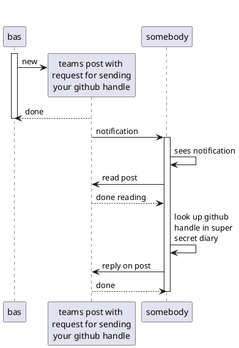

# Chapter 4

```plantuml
@startuml
skinparam backgroundColor transparent
participant bas
participant teams_post [
teams post with 
request for sending
your github handle
]
create teams_post
activate bas
bas -> teams_post : new
bas <-- teams_post : done
deactivate bas

teams_post -> somebody : notification
activate somebody
somebody -> somebody : sees notification
somebody -> teams_post : read post
teams_post --> somebody : done reading
somebody -> somebody : look up github \nhandle in super\nsecret diary
somebody -> teams_post : reply on post
teams_post --> somebody : done
deactivate somebody
@enduml
```