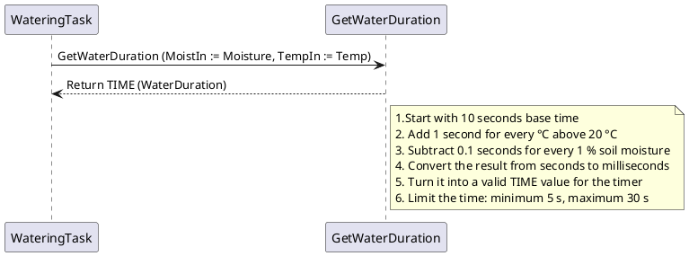

# Chapter 4

```plantuml
@startuml
participant "WateringTask" as Water
participant "GetWaterDuration" as Func

Water -> Func : GetWaterDuration (MoistIn := Moisture, TempIn := Temp)
Func --> Water : Return TIME (WaterDuration)
note right of Func
1.Start with 10 seconds base time
2. Add 1 second for every °C above 20 °C
3. Subtract 0.1 seconds for every 1 % soil moisture
4. Convert the result from seconds to milliseconds
5. Turn it into a valid TIME value for the timer
6. Limit the time: minimum 5 s, maximum 30 s
end note
@enduml
```